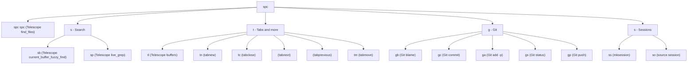

# My Personal Neovim Config

Main file that has my neovim config.

## Installation

I intentionally chose not to use a package mamager for my config. Since neovim has a pretty easy way to solve this problem, I just use git submodules to to download my packages. 

## Keybindings

