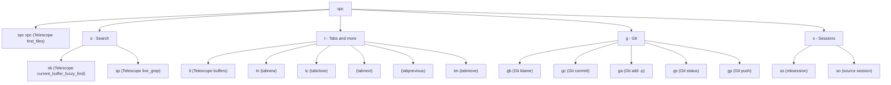

# My Personal Neovim Config

Main file that has my neovim config.

## Installation

I intentionally chose not to use a package mamager for my config. Since neovim has a pretty easy way to solve this problem, I just use git submodules to to download my packages. 

## Layout

`init.lua` is the entry point: the banner plus an ordered list of `require` calls. Everything else lives in `lua/`.

```
init.lua                       banner + ordered requires
lua/config/options.lua         editor settings
lua/config/keymaps.lua         leader + all global keybinds
lua/config/autocmds.lua        per-filetype indentation
lua/plugins/ui.lua             catppuccin, lualine, indent-blankline, noice
lua/plugins/editor.lua         telescope, treesitter, nvim-tree
lua/plugins/lsp.lua            LSP servers + on-attach keybinds
lua/plugins/completion.lua     nvim-cmp + vsnip
lua/git/inline_blame.lua       inline blame virtual text  (<leader>gB)
lua/git/blame_age.lua          commit-age gutter          (<leader>gh)
```

## Keybindings


```mermaid
graph TD;
    leader["spc"]
    leader1["spc spc (Telescope find_files)"]
    s["s - Search"]
    sb["sb (Telescope current_buffer_fuzzy_find)"]
    sp["sp (Telescope live_grep)"]
    t["t - Tabs and more"]
    tl["tl (Telescope buffers)"]
    tn["tn (tabnew)"]
    tc["tc (tabclose)"]
    tabnext["<tab> (tabnext)"]
    tabprev["<s-tab> (tabprevious)"]
    tm["tm (tabmove)"]
    g["g - Git"]
    gb["gb (Git blame)"]
    gc["gc (Git commit)"]
    ga["ga (Git add -p)"]
    gs["gs (Git status)"]
    gp["gp (Git push)"]
    ss["s - Sessions"]
    sss["ss (mksession)"]
    so["so (source session)"]

    leader --> leader1
    leader --> s
    s --> sb
    s --> sp
    leader --> t
    t --> tl
    t --> tn
    t --> tc
    t --> tabnext
    t --> tabprev
    t --> tm
    leader --> g
    g --> gb
    g --> gc
    g --> ga
    g --> gs
    g --> gp
    leader --> ss
    ss --> sss
    ss --> so
```
