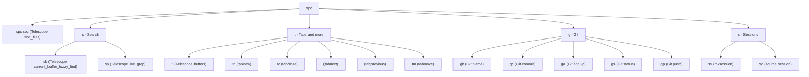

# My Personal Neovim Config

Main file that has my neovim config.

## Installation

I intentionally chose not to use a package mamager for my config. Since neovim has a pretty easy way to solve this problem, I just use git submodules to to download my packages. 

## Layout

`init.lua` is the entry point: the banner plus an ordered list of `require` calls. Everything else lives in `lua/`.

```
init.lua                       banner + ordered requires
lua/config/options.lua         editor settings
lua/config/keymaps.lua         leader + all global keybinds
lua/config/autocmds.lua        per-filetype indentation
lua/config/startup.lua         DEEPMAN welcome page
lua/plugins/ui.lua             catppuccin, lualine, indent-blankline, noice
lua/plugins/editor.lua         telescope, treesitter, nvim-tree
lua/plugins/lsp.lua            LSP servers + on-attach keybinds
lua/plugins/completion.lua     nvim-cmp + vsnip
lua/git/inline_blame.lua       inline blame virtual text  (<leader>gB)
lua/git/blame_age.lua          commit-age gutter          (<leader>gh)
```

## Startup page

Running `nvim` without a file opens a plugin-free welcome page showing the
original DEEPMAN ASCII banner. Click the banner to play one rotation, then return
to the original. Additional clicks during playback do not restart it.

The 36 text frames in `frames/frame_01.txt` through `frames/frame_36.txt` play at
80 ms per frame, inspired by [Codex's OpenAI animation](https://github.com/openai/codex/tree/6b0a1a8325640767b46f41525561f4f16b59abfd/codex-rs/tui/frames/openai).
The rotating frames use the original slanted outline artwork, with an exact
copy of the original at the start and end. Frames load once at startup in
filename order. Keep the zero-padded names and
equal line counts when editing them; trailing spaces are unnecessary.

Narrow windows show a compact DEEPMAN title. Rotation requires a window at
least 129 columns wide to fit the original 125-column artwork. The menu stays in place during rotation. Playback
pauses during picker and command input, and stops when the page closes or the
window becomes too small. Mouse input is enabled for the page and your previous
mouse setting is restored when you leave it.

| Key | Action |
| --- | --- |
| `f` | Find files |
| `r` | Recent files |
| `g` | Search text |
| `s` | Restore the session saved with `<leader>ss` |
| `n` | New file |
| `q` | Quit |

The page skips file arguments, restored sessions, piped input, and headless runs.
Existing leader mappings also work on the page.

## Keybindings


```mermaid
graph TD;
    leader["spc"]
    leader1["spc spc (Telescope find_files)"]
    s["s - Search"]
    sb["sb (Telescope current_buffer_fuzzy_find)"]
    sp["sp (Telescope live_grep)"]
    t["t - Tabs and more"]
    tl["tl (Telescope buffers)"]
    tn["tn (tabnew)"]
    tc["tc (tabclose)"]
    tabnext["<tab> (tabnext)"]
    tabprev["<s-tab> (tabprevious)"]
    tm["tm (tabmove)"]
    g["g - Git"]
    gb["gb (Git blame)"]
    gc["gc (Git commit)"]
    ga["ga (Git add -p)"]
    gs["gs (Git status)"]
    gp["gp (Git push)"]
    ss["s - Sessions"]
    sss["ss (mksession)"]
    so["so (source session)"]

    leader --> leader1
    leader --> s
    s --> sb
    s --> sp
    leader --> t
    t --> tl
    t --> tn
    t --> tc
    t --> tabnext
    t --> tabprev
    t --> tm
    leader --> g
    g --> gb
    g --> gc
    g --> ga
    g --> gs
    g --> gp
    leader --> ss
    ss --> sss
    ss --> so
```
